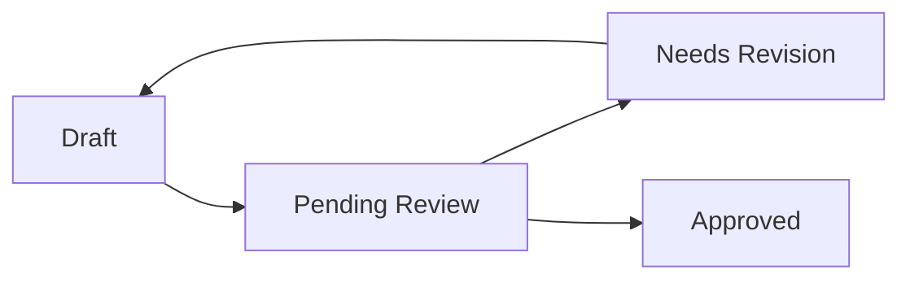

# Content Canvases & Campaign Planning

SteadySocial OS provides creative teams with a complete workspace to draft posts, adapt text captions for multiple networks, organize marketing campaigns, configure local automation rules, and manage scheduled publishing directly to Facebook.

---

## 🎨 The Content Canvases System

A **Content Canvas** is a workspace representing a specific theme, post set, or campaign. Each canvas contains a set of cards (`CanvasItem`) that can be edited, reviewed, and approved.

### Canvas Lifecycles & Workflow
Canvases transition through four distinct approval states (`CanvasStatus`):

- **Draft:** The creative team is composing ideas, uploading mockups, and writing initial text.
- **Pending Review:** Submitted to administrators for feedback. The canvas is locked for editing.
- **Needs Revision:** The administrator has rejected the canvas, adding specific text feedback in `adminFeedback` to guide revisions.
- **Approved:** Approved by the admin. Individual posts are ready to be published or scheduled.

### Multi-Network Adaptation
For each item in a canvas, the AI can rewrite the base text to optimize engagement across different social media channels:
- **Supported Platforms:** Facebook, Instagram, LinkedIn, TikTok, X (Twitter).
- **Caption Tones:** Friendly, Professional, Witty, Playful, Empathetic, Inspirational, Urgent.
- The system generates specific copies tailored to the platform rules (e.g., shorter and keyword-heavy for X; visual and hashtag-heavy for Instagram; professional and structured for LinkedIn).

---

## 📊 Campaign & Automation Management

Users can structure their local planning around marketing campaigns and assign automated triggers to handle customer behaviors.

### Marketing Campaigns
- Campaigns are stored in `campaigns.jsonl`.
- Properties include: Campaign Name, Budget (e.g. `₱5000`), Status (`ACTIVE`, `DRAFT`, `COMPLETED`), and Start/End Dates.
- Used to group content canvases and track performance metrics.

### Automation Rules
Automations allow agents to specify lightweight local actions triggered by CRM events:
- **Triggers:**
  - `NEW_MESSAGE_RECEIVED`: Triggers when a new thread is opened or a message arrives.
  - `NEW_LEAD_ADDED`: Triggers when a Lead Ad webhook registers a new contact.
  - `DAILY_SCHEDULE`: Run tasks periodically.
- **Actions:**
  - `SEND_AUTO_REPLY`: Send a pre-configured greeting or disclaimer.
  - `TAG_LEAD_HOT`: Assign a custom tag based on interest level.
  - `NOTIFY_TEAM`: Trigger a desktop notification or flag the thread.

---

## 📅 Facebook Publishing & Post Scheduler

Approved canvas items can be posted directly to the Facebook Page's feed.

### Direct Feed Publishing
- Messages, link URLs, and images (uploaded as Base64/data URLs and parsed by the backend) can be posted immediately.
- The Express backend calls the Facebook Graph API `/feed` or `/photos` endpoints to make the post live instantly.

### Post Scheduler
To schedule a post for a later date, the system sends a request to the local backend, which issues a Graph API request with `scheduled_publish_time`:
- **Parameter:** `scheduledPublishTime` (a Unix timestamp in seconds).
- **Facebook API Rules & Limits:**
  - **Minimum Delay:** Posts must be scheduled at least **10 minutes** in advance.
  - **Maximum Delay:** Posts cannot be scheduled more than **75 days** in advance.
  - **Unpublished State:** Scheduled posts remain in a pending, unpublished queue on Facebook's servers until the target timestamp is reached.
