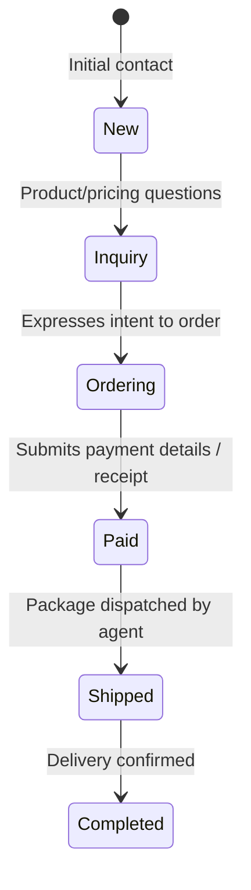

# CRM & Funnel Tracking System

SteadySocial OS features a local Customer Relationship Management (CRM) system designed to track potential buyers (leads) and existing customers through a structured sales funnel. It leverages automated chat status progression, real-time lead capture, and manual data adjustments.

---

## 📊 The Sales Funnel Hierarchy

The system defines six sequential funnel statuses to track the customer lifecycle:



These statuses are represented by the `CustomerStatus` type:
- `New`: Newly created record or initial thread contact.
- `Inquiry`: Active product/price queries.
- `Ordering`: Expressed intent to purchase (receives checkout template).
- `Paid`: Customer reports payment has been made (requires human verification).
- `Shipped`: Item is sent out (manual status transition).
- `Completed`: Customer confirms delivery or expresses final satisfaction.

---

## 1. Automatic Funnel Progression

As KIRA interacts with customers, a background tracker analyzes the conversation history to automatically advance their status.

### Status Progression Logic (`determineCustomerStatusFromChat`)
The tracker scans the last 5 messages sent by the customer and runs regex matches against key intent words:

| Target Status | Regex Keywords / Match Criteria | Description |
| :--- | :--- | :--- |
| **Inquiry** | `how much`, `hm`, `available`, `details`, `info`, `magkano`, `more info` | Customer is asking for details or prices. |
| **Ordering** | `order`, `buy`, `purchase`, `get`, `how to order`, `checkout`, `place order` | Customer wants to place an order. |
| **Paid** | `paid`, `payment`, `sent`, `receipt`, `proof of payment`, `nagbayad na`, `resibo` | Customer claims to have completed the payment. |
| **Shipped** | `shipped`, `delivered`, `received`, `got it`, `nakuha ko na` *(Only triggers if current status is `Paid`)* | Customer confirms the shipment has been sent/received. |
| **Completed** | `thanks`, `salamat`, `thank you`, `completed`, `done` *(Only triggers if current status is `Shipped`)* | Conversation ends positively. |

### 🛡️ The Anti-Downgrade Safeguard
To prevent conversational noise or miscellaneous inquiries from resetting a lead's sales status, SteadySocial OS enforces an anti-downgrade safeguard. 

Statuses are ranked in order of hierarchy:
$$\text{New (0)} < \text{Inquiry (1)} < \text{Ordering (2)} < \text{Paid (3)} < \text{Shipped (4)} < \text{Completed (5)}$$

When a new status is detected by the AI, the system checks its index. The status will **only** update if the newly detected status index is greater than the current status index:
```typescript
const STATUS_HIERARCHY = ['New', 'Inquiry', 'Ordering', 'Paid', 'Shipped', 'Completed'];
const currentIndex = STATUS_HIERARCHY.indexOf(currentStatus);
const detectedIndex = STATUS_HIERARCHY.indexOf(detectedStatus);

if (detectedIndex > currentIndex) {
  return detectedStatus; // Only allow progression forward
}
return currentStatus; // Block downgrade
```

---

## 2. Lead Capture Mechanisms

SteadySocial OS aggregates leads from multiple sources into the local `leads.jsonl` database:

### A. Real-Time Facebook Lead Ads Webhook
When a user submits a Facebook Lead Ad, a webhook is sent to `POST /facebook/webhook`.
1. The Express server validates the payload and extracts the `leadgen_id`.
2. Using the page access token, it queries the Facebook Graph API:
   `GET /v21.0/{leadgen_id}?fields=field_data,created_time,ad_id,form_id`
3. Parses the custom form fields (`field_data`), mapping dynamic field labels (like `full_name`, `phone_number`, `email`, `street_address`) into standard CRM properties.
4. Appends the lead record directly into `leads.jsonl` with the source set to `FACEBOOK_ADS`.

### B. Bulk Importing Lead Forms
Agents can manually run a bulk sync to fetch historical submissions:
1. **Forms Retrieval:** Queries `GET /facebook/lead-forms/:pageId` to list active page Lead Forms, showing status, creation time, and total lead count.
2. **Paginated Sync:** Queries `POST /facebook/leads/bulk-import` with a target `formId` and an optional date filter (`since` timestamp).
3. The server paginates through Facebook's response payloads, skipping records that already exist in the local database (keyed by `fbLeadId`) to prevent duplicates.

### C. Chat Transcript Extraction
As detailed in the KIRA documentation, the background CRM extractor parse customer details directly from the Messenger chat transcripts, updating the local database automatically.

---

## 3. Human Control & Overrides

While the system automates tracking, human agents have total authority over lead records:
- **Status Override:** Agents can change the funnel status at any time from the CRM sidebar, bypassing the anti-downgrade safeguard if a manual correction is required.
- **Manual Adjustments:** Allows manual editing of full names, emails, contact numbers, and addresses.
- **Agent Sticky Notes:** Agents can write custom sticky notes and tags. Custom tags (e.g., `VIP`, `payment_issue`) are saved directly and indexed for filtering.
