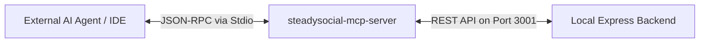

# Model Context Protocol (MCP) Server Integration

SteadySocial OS features an integrated **Model Context Protocol (MCP) server** (`steadysocial-mcp-server`) located at the subfolder `/steadysocial-mcp-server`. This enables external AI assistants (like Claude, Cursor, or other agents) to interact directly with the SteadySocial local workspace and database.

---

## 🔌 Architecture & Connection Flow

The MCP server runs over **Stdio transport**, allowing host applications to spin it up as a subprocess and pass standard JSON-RPC payloads.



The MCP server relies on a client (`steadysocialClient.ts`) to fetch, create, and update entries in the local Express server databases on port `3001`.

---

## 🛠️ Registered Tools Reference

The server registers a comprehensive suite of tools that expose SteadySocial capabilities to external agents.

### 1. `steadysocial_health_check`
- **Description:** Verifies if the local Express backend on port `3001` is running.
- **Parameters:** None.

### 2. Campaign Management Tools
- **`get_campaigns`:** Returns a JSON list of all active and draft marketing campaigns.
- **`create_campaign`:** Creates a campaign.
  - *Parameters:* `name` (string), `budget` (string, optional, e.g. `₱5000`), `status` (`'ACTIVE' | 'DRAFT' | 'COMPLETED'`), `startDate` (string, `YYYY-MM-DD`), `endDate` (string, `YYYY-MM-DD`).
- **`update_campaign`:** Updates an existing campaign.
  - *Parameters:* `id` (string), `name` (optional), `budget` (optional), `status` (optional), `startDate` (optional), `endDate` (optional).
- **`delete_campaign`:** Removes a campaign record.
  - *Parameters:* `id` (string).

### 3. Automation Tools
- **`get_automations`:** Retrieves configured automation rules.
- **`create_automation`:** Configures an automation rule.
  - *Parameters:* `name` (string), `trigger` (string, e.g., `NEW_MESSAGE_RECEIVED`), `action` (string, e.g., `SEND_AUTO_REPLY`), `actionValue` (string, optional), `isEnabled` (boolean, optional).
- **`update_automation`:** Updates an automation.
  - *Parameters:* `id` (string), and update parameters.
- **`delete_automation`:** Removes an automation rule.
  - *Parameters:* `id` (string).

### 4. Content & Canvas Tools
- **`get_canvases`:** Returns all saved canvases and post cards.
- **`create_canvas`:** Initializes a new blank canvas.
  - *Parameters:* `title` (string, optional), `status` (string, optional), `createdBy` (string, optional).

### 5. Facebook Connection & Publishing Tools
- **`get_facebook_settings`:** Reads integration details. *Access tokens are automatically redacted by the server for security.*
- **`get_scheduler_history`:** Lists past posted and scheduled Facebook publications.
- **`create_scheduler_task`:** Create a tactical scheduler task with optional milestones and priority.
  - *Parameters:* `text` (string), `description` (string, optional), `dueDate` (string, optional, `YYYY-MM-DD` or ISO), `priority` (`'LOW' | 'MEDIUM' | 'HIGH' | 'CRITICAL'`, optional), `status` (`'SCHEDULED' | 'COMPLETED' | 'IN_PROGRESS' | 'PENDING'`, optional), `page` (string, optional), `milestones` (string[], optional), `completionPercentage` (number, optional).
- **`create_facebook_post`:** Immediately publishes content to the page feed.
  - *Parameters:* `message` (string, optional), `link` (string, optional), `imageUrl` (string, optional).
- **`schedule_facebook_post`:** Schedules a post for a later date.
  - *Parameters:* `message` (string, optional), `link` (string, optional), `imageUrl` (string, optional), `scheduledPublishTime` (number, Unix timestamp).

### 6. Planning & Workspace File Tools
- **`create_planning_file`:** Allows the AI agent to write files directly into the workspace's folder structure.
  - *Parameters:* `path` (string), `type` (`'md' | 'docx' | 'xlsx' | 'csv' | 'html' | 'pdf'`), `content` (any), `isBase64` (boolean, optional).
- **`list_planning_files`:** Lists the planning files inside the workspace.
  - *Parameters:* `subPath` (string, optional).

### 7. CRM Tools
- **`list_crm_leads`:** Lists CRM leads from the pipeline.
  - *Parameters:* `filterStatus` (`'NEW' | 'CONTACTED' | 'QUALIFIED' | 'WON' | 'LOST'`, optional).

### 8. Board Data Import Tools
- **`import_crm_leads_to_board`:** Fetches CRM leads and appends them to a whiteboard as a Table card.
  - *Parameters:* `boardName` (string), `filterStatus` (optional), `cardX` (number, optional), `cardY` (number, optional).
- **`import_planning_file_to_board`:** Reads content from a planning file in the workspace and appends it to a whiteboard as a Sticky Note card.
  - *Parameters:* `boardName` (string), `filePath` (string), `cardX` (number, optional), `cardY` (number, optional), `maxChars` (number, optional).

### 9. Presentation Tools
- **`create_presentation`:** Creates a presentation from explicit slide data and returns a ready-to-use `componentCode` or HTML markup snippet.
  - *Parameters:* `title` (string), `slides` (array of slide objects), `customMarkup` (optional string), `theme` (optional), `transition` (optional).
  - Each slide object supports:
    - `title` (string, optional)
    - `content` (string)
    - `bgColor` (string, optional) — fallback background only, not the main styling path.
    - `customMarkup` (string, optional) — full HTML markup for the slide with Tailwind classes and UI elements.
  - *Note:* Do not rely on `bgColor` as the main visual output. For a full UI presentation, the agent should provide `customMarkup` per slide or top-level `customMarkup` and let the AI decide the complete layout, text styling, animations, card designs, and overall UX.
  - If `customMarkup` is provided, SteadySocial will render it directly as HTML, enabling rich Tailwind-driven UIs rather than plain text slides.
- **`generate_presentation_from_content`:** Auto-generates slides from a campaign, canvas, or custom text source.
  - *Parameters:* `sourceType` (`'campaign' | 'canvas' | 'custom'`), `sourceId` (optional), `customContent` (optional), `slideCount` (optional), `title` (optional).
  - *Note:* Generated presentations can still be customized by post-processing the returned content or by editing the generated component code to add Tailwind styles, animations, text formatting, and custom layout structures.

---

## ⚙️ Configuration for AI IDEs (e.g. Cursor, Claude Desktop)

To connect an IDE or external client to the MCP server, add the following to your configuration file (e.g., `claude_desktop_config.json`):

```json
{
  "mcpServers": {
    "steadysocial-mcp-server": {
      "command": "node",
      "args": [
        "c:/vs code/steadysocial/steadysocial-mcp-server/dist/index.js"
      ]
    }
  }
}
```

*Note: Ensure the MCP server is built (`npm run build` or `tsc` in `/steadysocial-mcp-server`) before starting the connection.*
