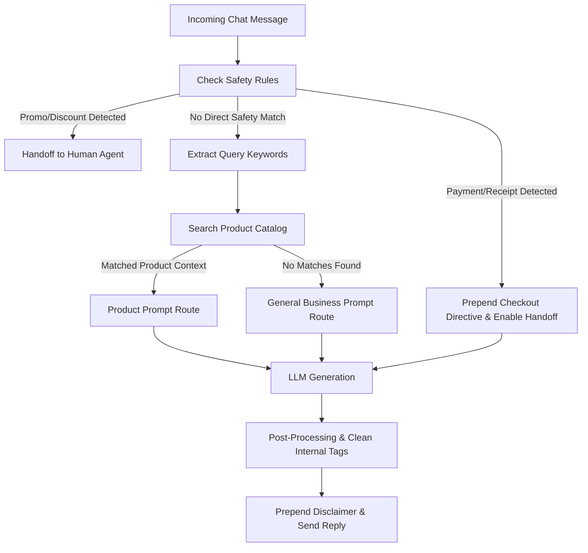

# KIRA - The Advanced AI Messenger Pipeline

KIRA is the automated AI messaging assistant integrated into SteadySocial OS. It uses custom natural language processing (NLP), semantic catalog searching, and state-aware prompt routing to manage customer conversations automatically while enforcing e-commerce safeguards.

---

## 🚀 The AI Chat Pipeline

When an incoming webhook is received or when an agent triggers an auto-reply, the conversation payload passes through the following pipeline:



---

## 1. Safety Rules & Auto-Interception

To prevent the AI assistant from committing to unauthorized pricing adjustments or misinterpreting transaction logs, two strict safety rules are configured in `messengerAiService.ts`:

### A. Promo & Discount Safety Interception
- **Trigger Keywords:** `promo`, `discount`, `sale`, `offer`, `special price`, `deal`, `deals`, `diskwento`, `tawad`, `bawas`, `less`.
- **Action:** Immediately halts AI inference. KIRA responds with a preconfigured polite reply:
  > *"That's a great question! For the latest and most accurate information on our current discounts and promos, let me connect you with one of our team members who can best assist you."*
- **State Change:** Appends `[HANDOFF]` to deactivate autopilot and alert a human agent.

### B. Payment Validation Directive
- **Trigger Keywords:** `paid`, `payment`, `sent payment`, `payment sent`, `bayad na`, `nagbayad na`, `nabayaran ko na`, `resibo`, `receipt`, `proof of payment`, `transaction slip`, `payment slip`.
- **Action:** If payment intent is detected, KIRA prepends a high-priority directive:
  - Instructs the AI to thank the customer.
  - Generates/displays the checkout form template to confirm details.
  - Explicitly requests the customer to upload their payment proof (receipt/slip).
  - Appends the `[HANDOFF]` tag to force human verification of the transaction.

---

## 2. Dynamic Prompt Routing

If no safety rules intercept the inquiry, the message query is routed by extracting keywords:

### Keyword Extraction (`extractKeywords`)
1. Analyzes the last user message using an AI-based Taglish keyword extractor (e.g., extracting "toner", "serum", or "acne" from Taglish messages).
2. If the AI method fails or times out, it falls back to a regex-based helper that cleans punctuation, filters out common Taglish stop words (`po`, `opo`, `magkano`, `ako`, `sa`, etc.), and splits the text.

### Catalog Filtering & Prompt Selection
- **Matched Products:** The extracted keywords are cross-referenced with the local product catalog (`product_data`).
- **Product Prompt Route:** If one or more products match, KIRA selects the Product Instruction. This injects the matching products' exact details (SKU, brand, size, price) directly into the prompt context. 
  - *Ambiguity Rule:* If multiple products match (e.g., "gentle retinol serum" and "niacinamide serum" for the keyword "serum"), the AI is instructed to present the list of matches and ask the user to clarify.
- **Business Prompt Route:** If no products match, KIRA falls back to the General Business Instruction, injecting shipping policies, payment methods, and a general text-based summary of the entire catalog.

---

## 3. The Taglish Persona & Tone Control

To build local rapport with buyers in the Philippines, KIRA is prompted to communicate with a distinct brand identity:
- **Language:** Natural Taglish (conversational mix of Tagalog and English).
- **Style:** Warm, helpful, polite, and emoji-friendly.
- **Always Be Closing (ABC):** Every response must end with a gentle question to guide the conversation forward (e.g., *"Ready ka na po bang umorder? 😊"* or *"May iba pa po ba akong pwedeng i-assist sa'yo?"*).

---

## 4. Intelligent Checkout Guidance

When a customer expresses intent to order, KIRA displays a standardized checkout form:

```text
Fullname:
Contact Details:
Orders:
Payment Method:
Shipping Method:
Shipping Address:
```

The customer completes this, and once they upload their payment receipt, KIRA flags the transaction, appends `[HANDOFF]`, and pauses autopilot.

---

## 5. Metadata Processing & AI Utilities

In addition to chat replies, the AI service runs asynchronous tasks to update the CRM:

### Customer Detail Extraction (`extractCustomerDetailsFromChat`)
Reads the last segment of the conversation transcript and extracts:
- `fullName` (Full Name)
- `contactNumber` (Phone number)
- `email` (Email address)
- `address` (Shipping address)
- `tags` (Generates tags like `VIP`, `skincare_interest`, `hot_lead`)
- `remarks` (Summarizes customer concerns in sticky-note format)
This data is stored back in IndexedDB automatically.

### Sentiment Analysis (`detectSentimentFromChat`)
Scans up to 30 past customer messages to classify the customer's final tone into `positive`, `neutral`, or `negative`. This helps agents prioritize tickets.

### Smart Follow-Up Generator
If a conversation has been silent, the agent can click **Follow Up**. KIRA reads the transcript, identifies the last topic discussed, and drafts a gentle, non-pushy re-engagement message according to a chosen tone (e.g., `warm`, `excited`, or `professional`).

---

## 6. Response Post-Processing

Before sending any generated response back through the Facebook API, SteadySocial OS applies post-processing steps:
1. **Safety Disclaimer Prepend:**
   Every message is prefixed with a disclaimer stating:
   > *"Hi, I'm your Personal Assistant from \*[Business Name]\*. Please be advised that my response may not be entirely accurate or up-to-date."*
2. **Tag Cleansing:**
   Internal tags (like `[HANDOFF]` or styling instructions) are stripped from the visible text.
3. **Handoff Trigger:**
   If `[HANDOFF]` was in the output, the system deactivates autopilot on IndexedDB for this conversation, alerting agents that a human must intervene.
